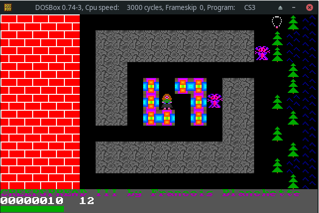
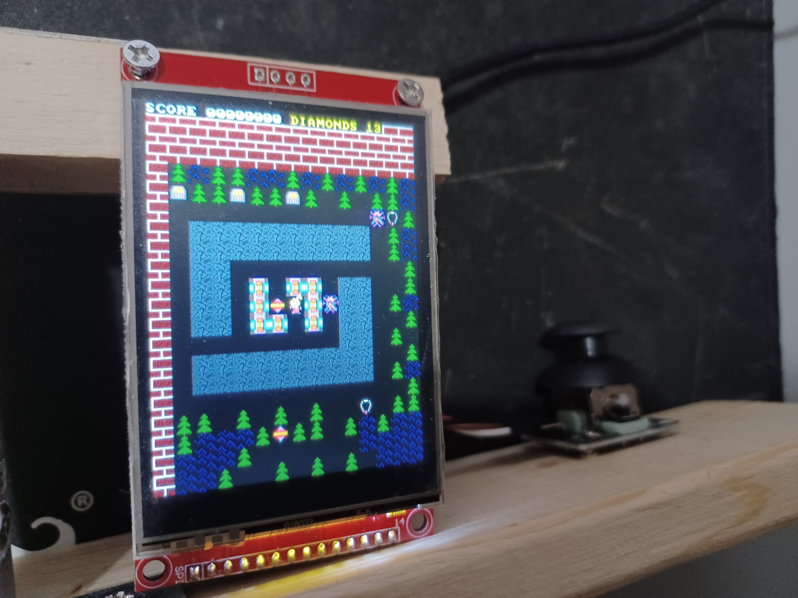

About
============================================================

This project is a game port to ESP-32 microcontroller an MS-DOS Game,

Current status is alpha. 90% of the core mechanic has been implemented.

Original MS-DOS
------------------------------------------

ESP-32
----------------------------------------

Here are the wiring arragements for the various parts needed.

ST7789
==================================================

|-----------|---------|-----------|
| ST7789    |wirecolor| GPIO Pin  |
|-----------|---------|-----------|
|SDK/MISO   | purple  |           |
|LED        | grey    |32 (BL???) |
}SCK        | yellow  |18         |
|SDI/MOSI   | orange  |23         |
|DC         | green   |27         |
|RESET      | brown   |33         |
|CS         | white   |25 ???     |
|GRN        | black   |           |
|VCC        | red     |3.3v or 5v |
|-----------|---------|-----------|

Joystick
===================================================

|-----------|---------|-----------|
| ST7789    |wirecolor| GPIO Pin  |
|-----------|---------|-----------|
|VRX 		| BROWN   | 35        |
|VRY 		| WHITE   | 34        |
|GRN		| black   |           |
|VCC		| red	  |	3.3v      |
|-----------|---------|-----------|

https://github.com/DiegoPaezA/ESP32-freeRTOS
