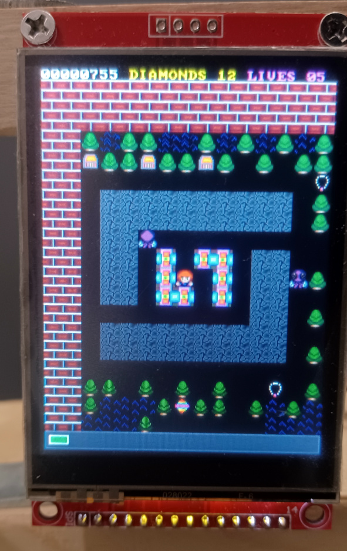

# About

This project is a game port to ESP-32 microcontroller of an MS-DOS Game.

Current status is alpha. 90% of the core mechanic has been implemented.

## Original MS-DOS


## ESP-32



I am also releasing the source code for the map editor:
https://github.com/cfrankb/cs3-map-edit

# Software required

esp-idf v5.1.2 or later.

# Installation

This project is based in part on: https://github.com/nopnop2002/esp-idf-st7789

```Shell
git clone https://github.com/cfrankb/esp-idf-cs3.git
cd esp-idf-cs3/
idf.py set-target {esp32/esp32s2/esp32s3/esp32c3}
idf.py menuconfig
idf.py flash
```

# Tested with this hardware

| Driver  | Resolution | Max SPI Freq | Display Inv |
| ------- | ---------- | ------------ | ----------- |
| ST7789  | 240x320    | 20M          | True        |
| ILI9341 | 240x320    | 40M          | False       |

## ESP-32

https://www.aliexpress.com/item/32959541446.html

## ST7789

https://www.aliexpress.com/item/1005004343881408.html

| ST7789   | wirecolor | GPIO Pin   |
| -------- | --------- | ---------- |
| SDK/MISO | purple    |            |
| LED      | grey      | 32 (BL???) |
| SCK      | yellow    | 18         |
| SDI/MOSI | orange    | 23         |
| DC       | green     | 27         |
| RESET    | brown     | 33         |
| CS       | white     | 14 or 25   |
| GRN      | black     | GRN        |
| VCC      | red       | 3.3v or 5v |

## Joystick

https://www.aliexpress.com/item/32345829014.html

| JOYSTICK | wirecolor | GPIO Pin |
| -------- | --------- | -------- |
| VRX      | brown     | 35       |
| VRY      | white     | 34       |
| SW       | blue      | 26       |
| GRN      | black     | GRN      |
| VCC      | red       | 3.3v     |

The above configuration is for the ESP32.
Pin out will vary per model. Check log output.

## Dupont cables

https://www.aliexpress.com/item/1005004611997111.html

## Button Module (optional)

https://www.aliexpress.com/item/32909058328.html

| Module | wirecolor | GPIO Pin  |
| ------ | --------- | --------- |
| GRN    | black     | GRN       |
| OUT    | green     | 4         |
| VCC    | red       | 3.3v / 5v |

## Further reading

https://github.com/DiegoPaezA/ESP32-freeRTOS
